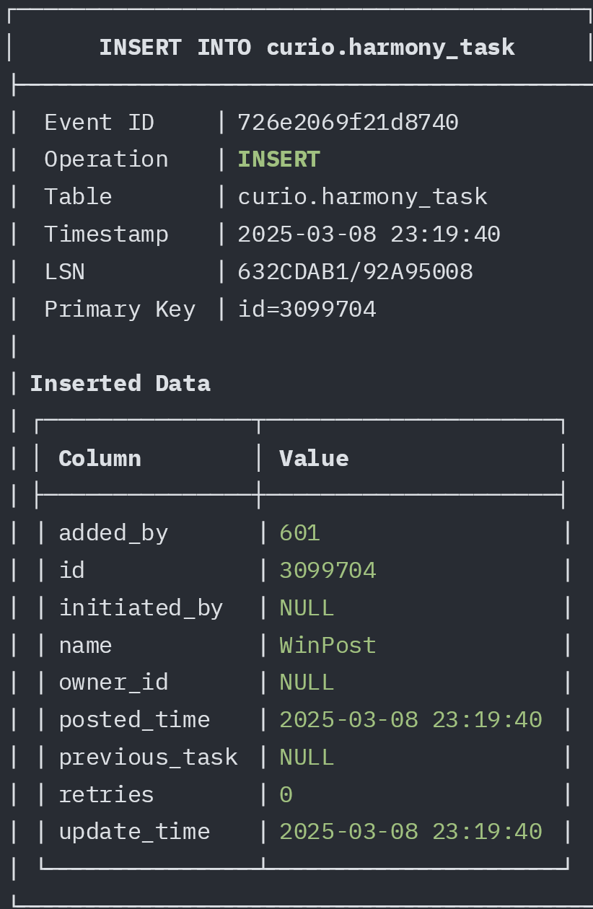
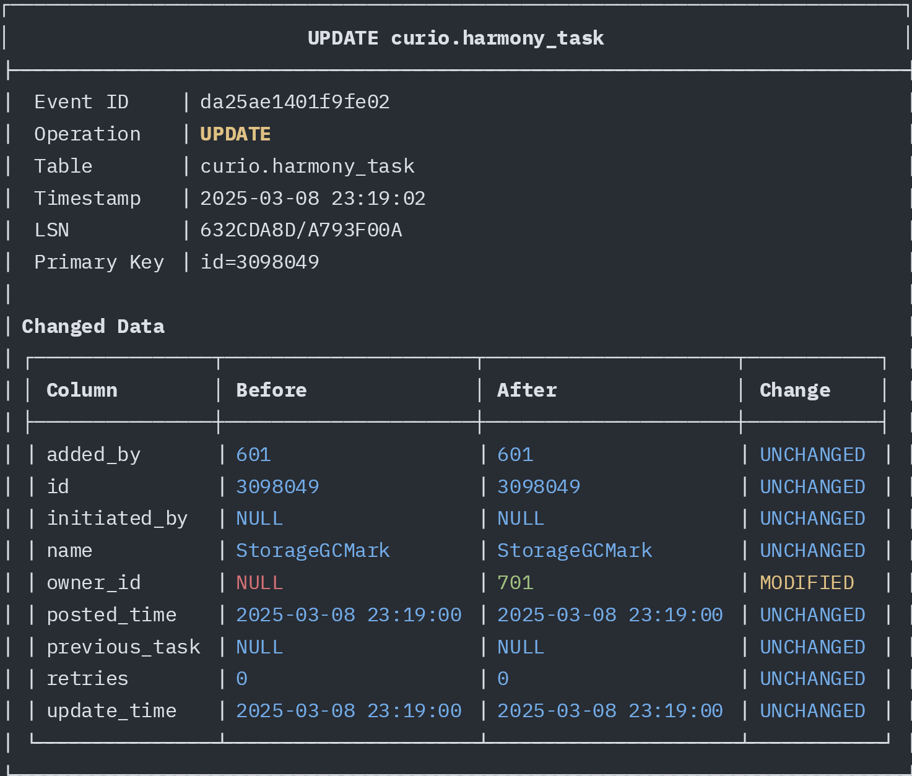
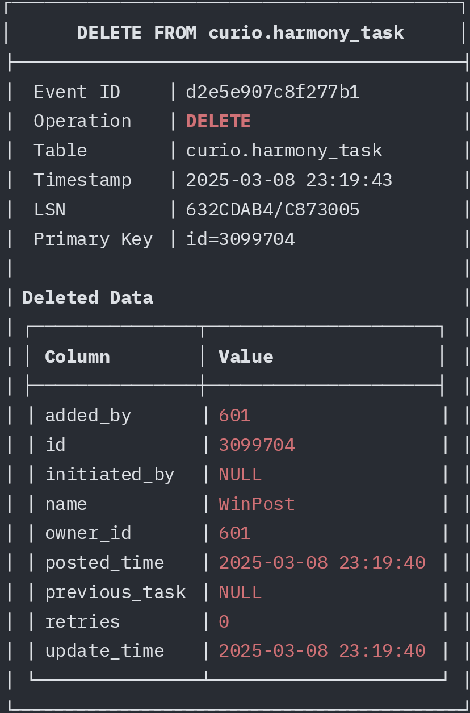

# curio-sentinel

A CLI tool and library for monitoring database changes in Curio clusters.

It builds on top of YugabyteDB's CDC feature and provides a simple way to monitor changes in the database.

## Table of Contents
* [Standalone Program Usage](#standalone-program-usage)
  * [Installation](#installation)
  * [Configuration](#configuration)
  * [Running](#running)
* [Library Usage](#library-usage)
  * [Basic Usage](#basic-usage)
  * [Terminal Output Example](#terminal-output-example)
* [Replica Identity and Output Differences](#replica-identity-and-output-differences)
  * [Replica Identity Types](#replica-identity-types)
  * [Output Comparison with Different Replica Identity Settings](#output-comparison-with-different-replica-identity-settings)
* [YugabyteDB logical replication library for Go](#yugabytedb-logical-replication-library-for-go)

## Standalone Program Usage

When used as a standalone program, curio-sentinel can be run directly from the command line without writing any additional code.

### Installation

To install the standalone program, run the following command:

```shell
make build
```

### Configuration

Create a `config.toml` configuration file with the following settings:

```toml
log_level = "debug"  # Optional: debug, info, warn, error

[capturer]
# Optional: customize slot and publication names
# slot_name = "curio_sentinel_slot"
# publication_name = "curio_sentinel_pub"
# drop_slot_on_stop = true
# drop_publication_on_stop = true

[capturer.database]
hosts = ["localhost"]
port = 5433
username = "yugabyte"
password = "yugabyte"
database = "your_database"

[sink]
type = "console"  # Currently supports "console" output
```
### Running

```shell
# Run with default config path (config.toml)
./curio-sentinel run

# Run with custom config path
./curio-sentinel run -c your-config.toml
```

Once started, the program will monitor database changes according to your configuration, filter and transform events as specified, and output them to the configured sink (default: console).

#### Insert

#### Update

#### Delete


## Library Usage

### Basic Usage

```go
package main

import (
	"context"
	"encoding/json"
	"fmt"
	"log"
	"os"
	"os/signal"
	"syscall"

	"github.com/strahe/curio-sentinel/capturer"
)

func main() {
	// Create a capturer config
	config := capturer.Config{
		Database: capturer.DatabaseConfig{
			Hosts:    []string{"localhost"},
			Port:     5433,
			Username: "yugabyte",
			Password: "yugabyte",
			Database: "your_curio_database",
		},
		// Specify tables to monitor, leave empty to monitor all tables
		Tables: []string{"curio.harmony_task"},
	}

	// Create a capturer
	cap := capturer.NewYugabyteCapturer(config, nil)
	if err := cap.Start(); err != nil {
		log.Fatalf("Failed to start capturer: %v", err)
	}

	// Set up signal handling
	sigCh := make(chan os.Signal, 1)
	signal.Notify(sigCh, syscall.SIGINT, syscall.SIGTERM)

	// Run the event processing in a goroutine
	go func() {
		for event := range cap.Events() {
			fmt.Println("------------------------------------------------------")
			fmt.Printf("Event: %s on %s.%s at %s\n", event.Type, event.Schema, event.Table, event.Timestamp)

			// handle event
			switch event.Type {
			case capturer.Insert, capturer.Delete:
				printJSON("Data", event.Data)
			case capturer.Update:
				printJSON("Before", event.Data["before"])
				printJSON("After", event.Data["after"])
			}
			// Acknowledge the event
			cap.ACK(context.Background(), event.LSN)
		}
	}()

	// Wait for termination signal
	<-sigCh
	fmt.Println("Stopping capturer...")

	// This will block until Stop completes
	// It may take a while to clean up the slot and publication in the database
	cap.Stop()
	fmt.Println("Capturer stopped, exiting")
}

func printJSON(label string, data any) {
	jsonData, err := json.MarshalIndent(data, "", "  ")
	if err != nil {
		fmt.Printf("Error marshaling %s to JSON: %v\n", label, err)
	} else {
		fmt.Printf("%s: %s\n", label, string(jsonData))
	}
}
```

### Terminal Output Example

When running the above code and performing operations in the database, the terminal will display output similar to:

```
------------------------------------------------------
Event: INSERT on curio.harmony_task at 2025-01-27 23:30:45.123456
Data: {
  "added_by": 1,
  "id": 48821,
  "initiated_by": null,
  "name": "WinPost",
  "owner_id": null,
  "posted_time": "2025-01-27T23:30:10.36213Z",
  "previous_task": null,
  "retries": 0,
  "update_time": "2025-01-27T23:30:10.36213Z"
}
------------------------------------------------------
Event: UPDATE on curio.harmony_task at 2025-01-27 23:31:12.654321
Before: {}
After: {
  "id": 48821,
  "owner_id": 1
}
------------------------------------------------------
Event: DELETE on curio.harmony_task at 2025-01-27 23:33:21.987654
Data: {
  "added_by": null,
  "id": 48821,
  "initiated_by": null,
  "name": null,
  "owner_id": null,
  "posted_time": null,
  "previous_task": null,
  "retries": null,
  "update_time": null
}
```

## Replica Identity and Output Differences

PostgreSQL (and YugabyteDB) use the Replica Identity setting to determine what data is recorded in the WAL logs during UPDATE and DELETE operations. This directly affects the content and completeness of data captured by CDC tools like curio-sentinel.

For more details, refer to the [PostgreSQL Replica Identity documentation](https://www.postgresql.org/docs/current/sql-altertable.html#SQL-CREATETABLE-REPLICA-IDENTITY) and [YugabyteDB Change Data Capture documentation](https://docs.yugabyte.com/preview/explore/change-data-capture/).

### Replica Identity Types

YugabyteDB supports [four Replica Identity modes](https://docs.yugabyte.com/preview/develop/change-data-capture/using-logical-replication/key-concepts/#replica-identity):
  1. **CHANGE (default)**
  2. **DEFAULT**
  3. **FULL**
  4. **NOTHING**

The replica identity INDEX is not supported in YugabyteDB.

### Output Comparison with Different Replica Identity Settings

#### FULL Mode (Complete Row Identification)

In FULL mode, UPDATE and DELETE events will include all column values for the row.

```sql
-- Set table to FULL mode, only works before slot creation
ALTER TABLE curio.harmony_task REPLICA IDENTITY FULL;
```

**UPDATE operation output example:**
```
Event: UPDATE on curio.harmony_task at 2025-01-27 23:45:41.781039 +0800 CST
Before: {
  "added_by": 1,
  "id": 50337,
  "initiated_by": null,
  "name": "WinPost",
  "owner_id": null,
  "posted_time": "2025-01-27T23:45:41.907074Z",
  "previous_task": null,
  "retries": 0,
  "update_time": "2025-01-27T23:45:41.907074Z"
}
After: {
  "added_by": 1,
  "id": 50337,
  "initiated_by": null,
  "name": "WinPost",
  "owner_id": 1,
  "posted_time": "2025-01-27T23:45:41.907074Z",
  "previous_task": null,
  "retries": 0,
  "update_time": "2025-01-27T23:45:41.907074Z"
}
```

**DELETE operation output example:**
```
Event: DELETE on curio.harmony_task at 2025-01-27 23:45:55.803845 +0800 CST
Data: {
  "added_by": 1,
  "id": 50337,
  "initiated_by": null,
  "name": "WinPost",
  "owner_id": 1,
  "posted_time": "2025-01-27T23:45:41.907074Z",
  "previous_task": null,
  "retries": 0,
  "update_time": "2025-01-27T23:45:41.907074Z"
}
```

## YugabyteDB Logical Replication Library for Go

Examples: [yugabyte.go](capturer/yugabyte.go)

Check out the [yblogrepl](yblogrepl/) for more information.
